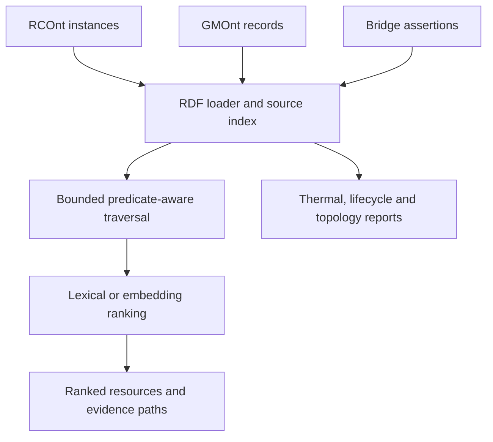

# Semantic Graph Traversal (SGT)

[](https://github.com/matinabtahi/SemanticGraphTraversal/actions/workflows/validate.yml)
[](LICENSE)
[](CHANGELOG.md)

**SGT** is a Python toolkit for traversing and analysing RDF graphs with traceable
evidence. It connects **RCOnt thermal models** and **GMOnt lifecycle archives** through
a small integration vocabulary and a domain-independent traversal engine.

> **Current version:** v0.1.0 — experimental research software.

## Why SGT?

Start at a retrofit record, follow its documented model version, retrieve that
version's thermal-model snapshot, and inspect a parameter with its units and source.
SGT returns the RDF path supporting each result. Relevance ranking helps find useful
resources while explicit predicates explain their relationship to the starting record.

## Relationship to the companion repositories

| Repository | Responsibility | Use in SGT |
| --- | --- | --- |
| [RCOnt](https://github.com/matinabtahi/Resistance-CapacitanceOntology) | RC structure, parameters, provenance and versions | Thermal-model inspection and snapshot traversal |
| [GMOnt](https://github.com/matinabtahi/Generational-MemoryOntology) | Persistent subjects, records, media and chronology | Lifecycle history and record traversal |
| **SGT** | Traversal, ranking and evidence | Executable analysis and two bridge predicates |

Existing namespaces are preserved. No changes to the companion repositories are
required. [Integration contract](docs/integration.md).

## Architecture



See [docs/architecture.md](docs/architecture.md) for module contracts, semantics,
algorithmic choices and limitations.

## Core capabilities

- Local Turtle loading with source membership and SHA-256 file hashes.
- Directed multigraphs preserving parallel RDF predicates.
- Incoming, outgoing or bidirectional traversal with predicate filters and budgets.
- Deterministic shortest-hop evidence paths, retaining original triple direction.
- Offline lexical ranking or optional locally executed embedding ranking.
- Thermal-parameter inspection, lifecycle history and structural graph metrics.
- A linked retrofit example, executable SPARQL, SHACL constraints and regression tests.

## Repository layout

```text
.
├── SGT.ttl                    # RCOnt–GMOnt bridge vocabulary
├── src/sgt/                   # Python API, traversal, ranking, reports and CLI
├── examples/                  # Synthetic retrofit dataset
├── queries/                   # Executable SPARQL
├── shapes/                    # Application-level SHACL profile
├── docs/                      # Architecture and integration contract
├── vendor/                    # Pinned upstream schemas for offline tests
├── tests/                     # Behavioural and integration tests
├── .github/workflows/         # Validation and package build
├── pyproject.toml
├── requirements.txt
├── CITATION.cff
├── .zenodo.json
├── CHANGELOG.md
├── CONTRIBUTING.md
├── NOTICE.md
└── LICENSE
```

## Quick start

From a clone or extracted source archive:

```bash
python -m venv .venv
# Linux/macOS: source .venv/bin/activate
# Windows PowerShell: .venv\Scripts\Activate.ps1
python -m pip install -r requirements.txt
python -m pytest -q
```

Traverse from a lifecycle record:

```bash
python -m sgt.cli traverse --data examples/retrofit.ttl --start 'https://example.org/sgt-demo#AfterRecord' --query 'insulation thermal resistance' --max-depth 3 --output outputs/traversal.json
```

Inspect model parameters, retrieve the zone's history, or analyse topology:

```bash
python -m sgt.cli thermal --data examples/retrofit.ttl --start 'https://example.org/sgt-demo#AfterModel'
python -m sgt.cli lifecycle --data examples/retrofit.ttl --start 'https://example.org/sgt-demo#ZoneA'
python -m sgt.cli topology --data examples/retrofit.ttl
```

The installed command is also available as `sgt`. The wheel contains the Python
package; use the repository/source archive for examples, schemas and queries.

## Python API

```python
from rdflib import URIRef
from sgt import SemanticGraph, traverse
from sgt.namespaces import RC, SGT

graph = SemanticGraph.load(['examples/retrofit.ttl'])
result = traverse(
    graph, URIRef('https://example.org/sgt-demo#AfterRecord'),
    query='insulation thermal resistance', direction='out',
    predicates={SGT.documentsModelVersion, SGT.hasModelSnapshot, RC.hasResistance},
    max_depth=3,
)
for hit in result['results']:
    print(hit['node'], hit['score'], hit['path'])
```

## Optional embedding ranking

```bash
python -m pip install -e '.[embeddings]'
python -m sgt.cli traverse --data examples/retrofit.ttl --start 'https://example.org/sgt-demo#AfterRecord' --query 'improved envelope insulation' --embedding-model sentence-transformers/all-MiniLM-L6-v2
```

The first use may download model weights. Supply a local model path for offline use.
No hosted LLM or API key is required. The default scorer is **lexical cosine**, not
an embedding model. Optional embeddings are not exercised by default CI. Custom
scorers implement `name` and `score(query, texts)`, with one finite score per text.
Scores express retrieval relevance, not confidence that a claim is true.

## Validation and reproducibility

```bash
python -m pytest -q
python -m build
```

Tests cover source provenance, cycles, reverse edges, parallel predicates, budgets,
weak-text connectors, all CLI reports, SPARQL results, and positive/negative SHACL
cases against pinned upstream schemas. The configured CI matrix uses Python 3.10
and 3.12. Source hashes and retrieval settings accompany traversal results.

`vendor/manifest.json` records exact upstream commits. Files are loaded explicitly;
imports and media URLs are never fetched automatically.

## Scope and limitations

SGT traverses asserted RDF; it does not run OWL inference. SHACL validation uses
RDFS inference separately. It collects a bounded neighborhood before ranking, so
weakly matching connectors remain reachable. A node-budget cap can still exclude
relevant nodes and is reported explicitly. A graph path indicates a recorded
relationship, not causation or physical model validity.

This version has no LLM answer writer, document extraction, RC solver or MPC controller.
Topology metrics concern resource edges, not numerical thermal dynamics. The entire
graph is loaded into memory; large graphs require appropriate scope and budgets.

## Reference and attribution

Inspired by [Verdagio/semantic-graph-traversal-and-analysis](https://github.com/Verdagio/semantic-graph-traversal-and-analysis).
SGT is an independent RDF-focused implementation, with a different collect-then-rank
algorithm. No code was copied from that project. See [NOTICE.md](NOTICE.md).

## Citation

[CITATION.cff](CITATION.cff) and [.zenodo.json](.zenodo.json) follow the companion
repositories' conventions. Cite the version or commit until a release is archived;
no DOI is claimed for this initial version.

## Contributing

See [CONTRIBUTING.md](CONTRIBUTING.md). Ontology changes belong in the relevant
upstream repository; integration and traversal changes belong here.

## License

MIT; see [LICENSE](LICENSE). Upstream attribution is retained in `vendor/`.

## Author

**Matin Abtahi**  
Concordia University, Montréal, Canada  
ORCID: [0000-0003-3941-9485](https://orcid.org/0000-0003-3941-9485)
