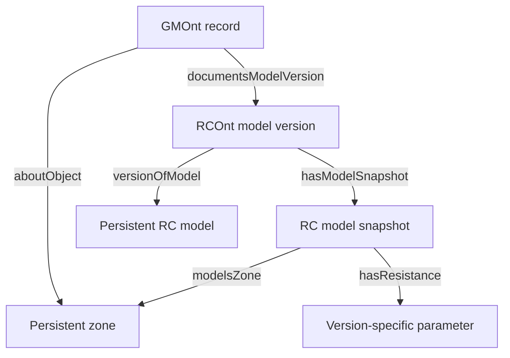

# RCOnt–GMOnt integration contract

| Prefix | Preserved namespace |
| --- | --- |
| rc: | https://matinabtahi.github.io/OperationalDigitalTwinning/RCOnt# |
| gm: | https://matinabtahi.github.io/Generational-MemoryOntology/GMOnt# |
| sgt: | https://matinabtahi.github.io/SemanticGraphTraversal/SGT# |

The SGT namespace is a proposed stable identifier; a resolving GitHub Pages ontology
site is not deployed by this implementation.

The same zone resource can be typed brick:HVAC_Zone and gm:Object when both identify
the same real subject; the classes are not declared equivalent. gm:sameSubjectAs
connects records, not models or zones, and is not owl:sameAs.

The persistent model has rc:hasModelVersion links. Each version points through
sgt:hasModelSnapshot to a distinct rc:RCModel resource containing that version's
structure and parameters. Version-specific parameter instances prevent historical
values being overwritten. prov:wasRevisionOf can link successive versions.

Records explicitly document versions through sgt:documentsModelVersion. Do not infer
this link from filename similarity, dates or embeddings. Media can support a record
without being reclassified as a model version.

## Integrating existing datasets

1. Retain existing RCOnt/GMOnt identifiers.
2. Identify the persistent zone/object and explicitly link its records.
3. Create distinct model versions and snapshots where absent.
4. Add the two bridge predicates in a separate Turtle file.
5. Load instance and bridge files with SemanticGraph.load([...]).
6. Validate with the SGT shapes and pinned upstream schemas.
7. Traverse with predicate filters or run the history SPARQL query.

No upstream repository edits are required. Pinned schemas in vendor/ are compatibility
fixtures, not automatic runtime imports. Update their commits/hashes explicitly and
run the tests when adopting upstream changes.

The example answers which resistance belongs to the version documented by a record,
which earlier records concern the zone, which media each record carries, and what RDF
path/source supports the connection. It does not establish a causal retrofit effect.
